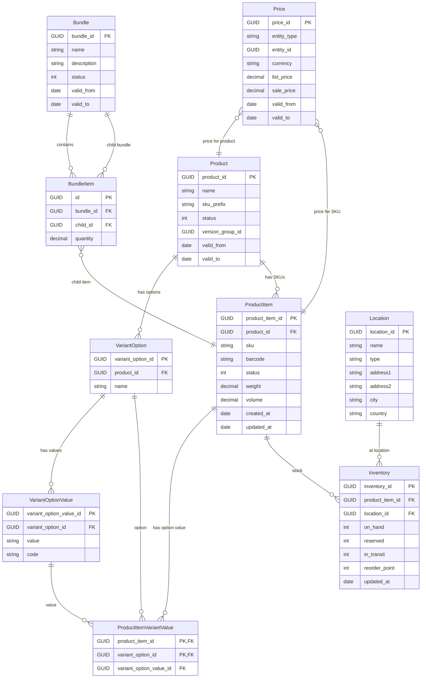

# Features
- Product Variant CRUD
- Product Bundle CRUD
- Product Item CRUD

# Prerequisite
- .NET 8 SDK
- PostgreSQL
- EF Core Tool (migration)

# My Approach
- Clean (Layered) Architecture
- Repository Pattern
- EF Core + Dapper
- FluentValidation
- Dependency Injection
- Swagger Integration

# Database Diagram

