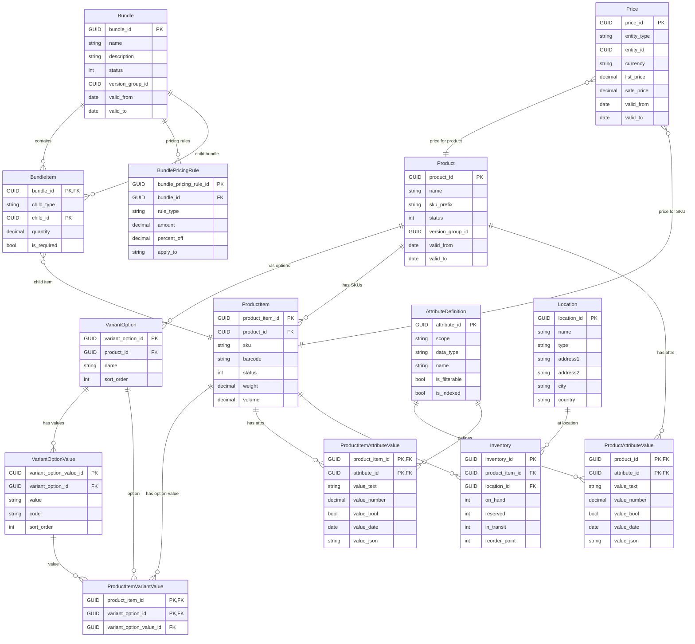

```mermaid

erDiagram
  Product ||--o{ VariantOption : "has options"
  VariantOption ||--o{ VariantOptionValue : "has values"
  Product ||--o{ ProductItem : "has SKUs"
  ProductItem ||--o{ ProductItemVariantValue : "has option-value"
  VariantOption ||--o{ ProductItemVariantValue : "option"
  VariantOptionValue ||--o{ ProductItemVariantValue : "value"

  Product ||--o{ ProductAttributeValue : "has attrs"
  ProductItem ||--o{ ProductItemAttributeValue : "has attrs"
  AttributeDefinition ||--o{ ProductAttributeValue : "defines"
  AttributeDefinition ||--o{ ProductItemAttributeValue : "defines"

  ProductItem ||--o{ Inventory : "stock"
  Location ||--o{ Inventory : "at location"

  Bundle ||--o{ BundleItem : "contains"
  Bundle ||--o{ BundlePricingRule : "pricing rules"
  BundleItem }o--|| ProductItem : "child item"
  BundleItem }o--|| Bundle : "child bundle"

  Price }o--|| Product : "price for product"
  Price }o--|| ProductItem : "price for SKU"

  Product {
    GUID product_id PK
    string name
    string sku_prefix
    int status
    GUID version_group_id
    date valid_from
    date valid_to
  }

  VariantOption {
    GUID variant_option_id PK
    GUID product_id FK
    string name
    int sort_order
  }

  VariantOptionValue {
    GUID variant_option_value_id PK
    GUID variant_option_id FK
    string value
    string code
    int sort_order
  }

  ProductItem {
    GUID product_item_id PK
    GUID product_id FK
    string sku
    string barcode
    int status
    decimal weight
    decimal volume
  }

  ProductItemVariantValue {
    GUID product_item_id PK,FK
    GUID variant_option_id PK,FK
    GUID variant_option_value_id FK
  }

  AttributeDefinition {
    GUID attribute_id PK
    string scope
    string data_type
    string name
    bool is_filterable
    bool is_indexed
  }

  ProductAttributeValue {
    GUID product_id PK,FK
    GUID attribute_id PK,FK
    string value_text
    decimal value_number
    bool value_bool
    date value_date
    string value_json
  }

  ProductItemAttributeValue {
    GUID product_item_id PK,FK
    GUID attribute_id PK,FK
    string value_text
    decimal value_number
    bool value_bool
    date value_date
    string value_json
  }

  Location {
    GUID location_id PK
    string name
    string type
    string address1
    string address2
    string city
    string country
  }

  Inventory {
    GUID inventory_id PK
    GUID product_item_id FK
    GUID location_id FK
    int on_hand
    int reserved
    int in_transit
    int reorder_point
  }

  Price {
    GUID price_id PK
    string entity_type
    GUID entity_id
    string currency
    decimal list_price
    decimal sale_price
    date valid_from
    date valid_to
  }

  Bundle {
    GUID bundle_id PK
    string name
    string description
    int status
    GUID version_group_id
    date valid_from
    date valid_to
  }

  BundleItem {
    GUID bundle_id PK,FK
    string child_type
    GUID child_id PK
    decimal quantity
    bool is_required
  }

  BundlePricingRule {
    GUID bundle_pricing_rule_id PK
    GUID bundle_id FK
    string rule_type
    decimal amount
    decimal percent_off
    string apply_to
  }

```